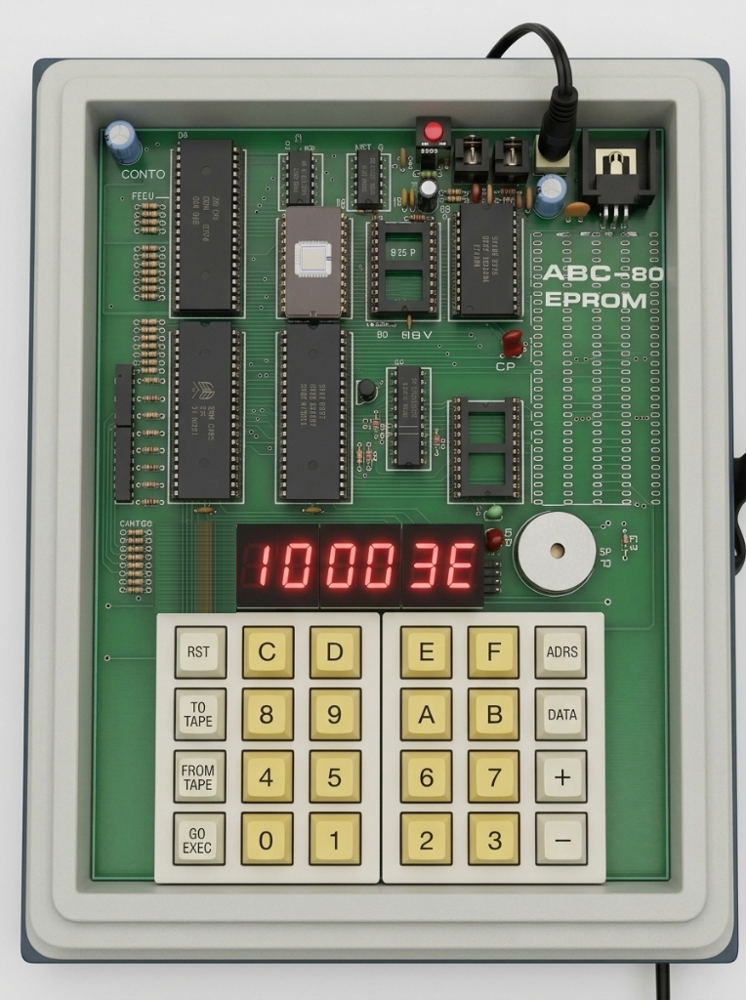
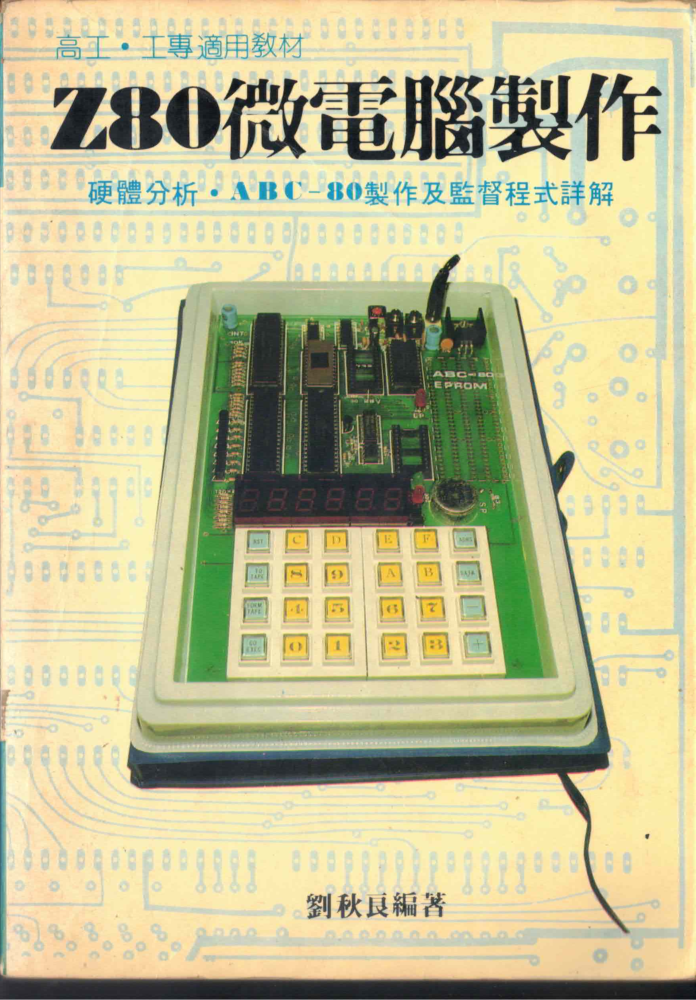
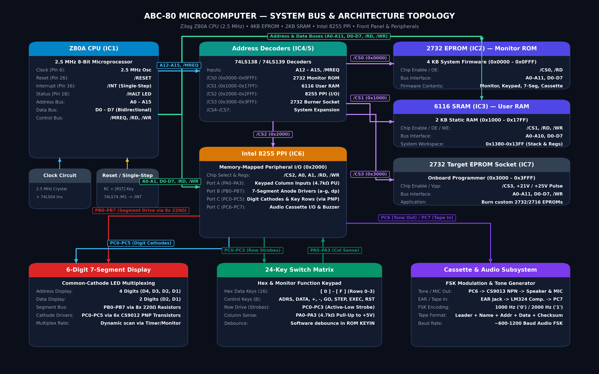

# ABC-80 Microcomputer Emulator

An emulator and toolchain project for the **ABC-80**, a classic Taiwanese Z80-based educational single-board microcomputer kit from the 1980s.

## Project Overview

The ABC-80 was designed for hands-on learning of microcomputer architecture, assembly language programming, and hardware interfacing. It integrates a Zilog Z80 CPU, EPROM monitor firmware, static RAM, an onboard hex keypad, a 6-digit multiplexed 7-segment LED display, an Intel 8255 Programmable Peripheral Interface (PPI), audio cassette tape I/O, and an onboard 2732 EPROM programmer.

This project aims to provide:
* **Accurate Hardware Emulation**: Cycle-accurate emulation of the Z80 CPU, memory map, discrete TTL logic, 8255 PIO, keypad matrix, and display timing.
* **Interactive UI**: Virtual front-panel interface simulating the physical 6-digit LED display and 24-key matrix.
* **Audio / Cassette Interface**: Emulated cassette tape loading and saving (Kansas City / FSK modulated audio format).
* **Reference Documentation**: Complete digitized schematics, component manuals, and monitor ROM documentation.

## Hardware Architecture & Appearance

| Physical Hardware Board | Original Construction Guide |
| :---: | :---: |
|  |  |



---

## Memory Architecture: Authentic 2KB vs. Full 64KB Emulation

While the physical ABC-80 was produced with 2KB ROM and 2KB RAM to minimize manufacturing costs in the 1980s, its architecture was designed with system expansion in mind via a 44-pin edge connector bringing out the complete Z80 address, data, and control buses.

### The Monitor ROM `ramchk` Discovery

Reverse engineering and disassembling the original 2KB Monitor ROM ([`src/rom.asm`](./src/rom.asm)) revealed that **the original firmware already natively supports up to 64KB of RAM without any code changes**. 

When a user selects an address and presses `DATA` to inspect or modify memory, the Monitor executes subroutine `ramchk` at `049dh`:

```z80
; Dynamic RAM Probe: Check if Address in HL Points to Writeable RAM
; (Reads, inverts, writes, reads back, restores, and compares with CP (HL))
; Returns: Zero flag = 1 if RAM; Zero flag = 0 if ROM or unmapped memory
049d: ramchk:
            ld      a,(hl)          ; [7e] read original byte from memory
            cpl                     ; [2f] invert bits
            ld      (hl),a          ; [77] write inverted test byte to target address
            ld      a,(hl)          ; [7e] read back from memory
            cpl                     ; [2f] invert back to restore original value
            ld      (hl),a          ; [77] restore original byte to memory
            cp      (hl)            ; [be] compare: if writable RAM, Z=1; if ROM/floating bus, Z=0
            ret                     ; [c9] done
```

Because `ramchk` performs a **dynamic read-modify-write test** rather than checking a hardcoded address range, any RAM mapped into the Z80 address space is immediately recognized as valid, writable memory by the stock Monitor ROM.

### Memory Layout Comparison

```text
       Z80 Maximum Space (64 KB)                 Expanded Emulator Mode (Default)
 0000h +-----------------------------------+    0000h +-----------------------------------+
       |                                   |          | 2KB Monitor ROM (2716 EPROM)      | (Read-Only)
 0800h |                                   |    0800h +-----------------------------------+
       |                                   |          | 2KB Low Expansion RAM             | (Read/Write)
 1000h |                                   |    1000h +-----------------------------------+
       |                                   |          | 2KB System RAM & OS Workspace     | (Read/Write)
 1800h |                                   |    1800h +-----------------------------------+
       |                                   |          |                                   |
       | 64 KB Total Addressable Space     |          |                                   |
       | (A0 - A15 Address Bus)            |          | 58 KB High Expansion RAM          | (Read/Write)
       |                                   |          | (Continuous user programs, stacks,|
       |                                   |          |  interpreters, and data buffers)  |
       |                                   |          |                                   |
 FFFFh +-----------------------------------+    FFFFh +-----------------------------------+
```

* **Stock Hardware Mode**: 2KB ROM (`0000h - 07ffh`), 2KB SRAM (`1000h - 17ffh`), and 58KB unmapped open-bus space.
* **Expanded Emulator Mode**: 2KB ROM (`0000h - 07ffh`), 62KB contiguous RAM (`0800h - ffffh`). Allows loading large software packages, moving the user stack to `0ffffh`, and writing programs far beyond the 500-byte stock limit while remaining 100% faithful to the ABC-80 firmware and bus architecture.

### I/O Port Address Space

The ABC-80 addresses its Intel 8255 PPI and accessories via Z80 `IN`/`OUT` port instructions:
* **Ports `80h - 83h`**: Primary Onboard 8255 PPI (Port A = Keypad rows & tape audio in; Port B = 7-Segment segment bus; Port C = Digit multiplexers & audio out; Port 83h = Control).
* **Ports `40h - 43h`**: Auxiliary 8255 PPI (2716 EPROM programmer address low, data bus, address high/control, and mode register).

---

## Documentation Links

* [**ABC-80 Hardware Overview (`doc/ABC-80.md`)**](./doc/ABC-80.md) — Comprehensive reference with CPU-to-8255 schematics, peripheral multiplexing circuits, memory map, pin tables, and monitor ROM API.
* [**Monitor ROM Assembly Source (`src/rom.asm`)**](./src/rom.asm) — Complete 2KB Monitor ROM disassembled in Modern Unix/GNU lowercase assembly with full English engineering comments.
* [**Scanned Reference Manuals (`scanned_docs/README.md`)**](./scanned_docs/README.md) — Consolidated PDF documentation ([`scanned_docs/Z80_Micro_Computer_Building.pdf`](./scanned_docs/Z80_Micro_Computer_Building.pdf)), scanning tools, and interactive network scanner protocol.
