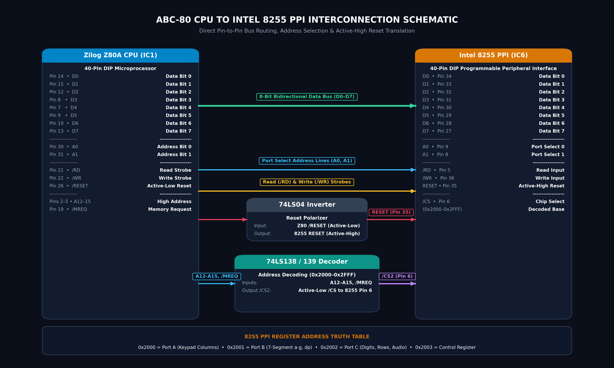
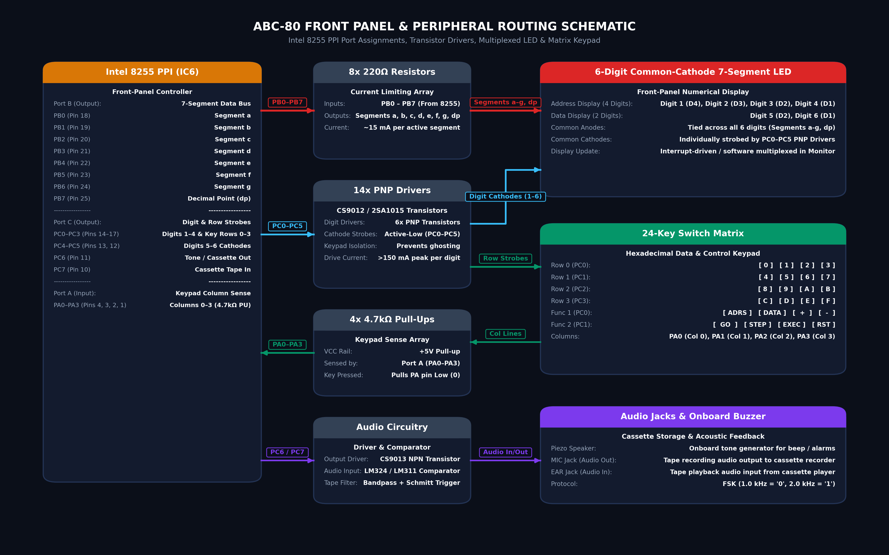

# ABC-80 Microcomputer Hardware Specifications & Architecture Reference

The **ABC-80** is a classic Taiwanese Z80-based single-board educational microcomputer kit from the 1980s, manufactured and published by *Chuan-Hwa Science & Technology (全華科技圖書)*, and documented in the authoritative manual *《Z-80 微電腦製作 — 硬體分析・ABC-80製作及監督程式詳解》*.

All circuitry is integrated onto a single gold-plated, double-sided through-hole printed circuit board (PCB), providing students, engineers, and hobbyists with a complete platform to learn microprocessor architecture, assembly programming, I/O interfacing, and peripheral design.

---

## 1. Physical Board Appearance & Historical Documentation

| Hardware Reference Board | Reference Manual Front Cover |
| :---: | :---: |
|  |  |
| *Figure 1: ABC-80 single-board microcomputer* | *Figure 2: Authoritative construction manual cover* |

---

## 2. System Architecture & Memory Map

The ABC-80 is an upgraded model (*改造型*) featuring 4 KB of EPROM and 2 KB of static RAM, replacing earlier 1 KB (2114) configurations. Address decoding is implemented using discrete 74LS138 / 74LS139 TTL decoders driven by high-order address lines ($A_{12}–A_{15}$) and CPU bus control signals ($\overline{\text{MREQ}}$, $\overline{\text{RD}}$, $\overline{\text{WR}}$).

### Memory Map

The ABC-80's physical address space accommodates the 2KB Monitor ROM, 2KB static RAM, and external bus expansion. Address decoding is implemented using discrete 74LS138 / 74LS139 TTL decoders driven by high-order address lines ($A_{11}–A_{15}$) and CPU bus control signals ($\overline{\text{MREQ}}$, $\overline{\text{RD}}$, $\overline{\text{WR}}$).

| Address Range | Size | Component | Function | Decoding / Control |
| :--- | :---: | :--- | :--- | :--- |
| `0x0000` – `0x07FF` | 2 KB | **2716 EPROM** | Monitor ROM, Display/Keypad Drivers, Cassette I/O, Melody Chimes | $\overline{\text{CS}}_0$, $\overline{\text{OE}} = \overline{\text{RD}}$ |
| `0x0800` – `0x0FFF` | 2 KB | *Low RAM Expansion* | Available expansion space (populated as RAM in Expanded Emulation Mode) | Bus expansion slot |
| `0x1000` – `0x17FF` | 2 KB | **6116 SRAM** | User Program Memory, System Stack, and Monitor Variables | $\overline{\text{CS}}_1$, $\overline{\text{OE}} = \overline{\text{RD}}$, $\overline{\text{WE}} = \overline{\text{WR}}$ |
| `0x13CC` – `0x13DF` | 20 B | *Register Save Block* | Monitor CPU register storage for `RST 38H` debugger (`F, A, C, B, E, D, L, H, F', A', C', B', E', D', L', H', IX, IY`) | Internal to 6116 SRAM |
| `0x13E0` – `0x13E3` | 4 B  | *SP / PC Save Area* | Saved user stack pointer (`spsave`) and program counter (`pcsave`) | Internal to 6116 SRAM |
| `0x17C6` – `0x17CB` | 6 B  | *Display Buffer* | 6-digit LED display font buffer (`dispbf`: 4 address digits, 2 data digits) | Internal to 6116 SRAM |
| `0x17EE` – `0x17F5` | 8 B  | *OS Workspace* | Current address (`adsave`), state machine (`state`), power-up flag (`pwup`) | Internal to 6116 SRAM |
| `0x1800` – `0xFFFF` | 58 KB | *High Expansion RAM* | 58 KB continuous user RAM in Expanded Emulation Mode (unmapped in stock 1980 hardware) | 44-Pin Bus Expansion Slot |

```text
       Z80 Maximum Space (64 KB)                 Expanded Emulator Mode (Default)
 0000h +-----------------------------------+    0000h +-----------------------------------+
       |                                   |          | 2KB Monitor ROM (2716 EPROM)      | (Read-Only)
 0800h |                                   |    0800h +-----------------------------------+
       |                                   |          | 2KB Low Expansion RAM             | (Read/Write)
 1000h |                                   |    1000h +-----------------------------------+
       |                                   |          | 2KB System RAM & OS Workspace     | (Read/Write)
 1800h |                                   |    1800h +-----------------------------------+
       |                                   |          |                                   |
       | 64 KB Total Addressable Space     |          |                                   |
       | (A0 - A15 Address Bus)            |          | 58 KB High Expansion RAM          | (Read/Write)
       |                                   |          | (Continuous user programs, stacks,|
       |                                   |          |  interpreters, and data buffers)  |
       |                                   |          |                                   |
 FFFFh +-----------------------------------+    FFFFh +-----------------------------------+
```

### Dynamic RAM Detection (`049dh: ramchk`)

The ABC-80 Monitor ROM dynamically tests RAM rather than using hardcoded bounds. Subroutine `ramchk` at `049dh` performs a read-modify-write test (`cpl` / `ld (hl), a` / `cp (hl)`). Any address where RAM is mapped in the 64KB space is automatically recognized and accepted for data entry and execution with zero firmware patching.

### I/O Port Address Space

The ABC-80 uses Z80 `IN`/`OUT` instructions with `/IORQ` asserted:
* **Ports `0x80` – `0x83`**: Primary Onboard Intel 8255 PPI:
  * Port A (`0x80`, Input): Keypad matrix 4 rows (bits 0–3) & cassette audio in (bit 7).
  * Port B (`0x81`, Output): 7-segment LED cathode/anode drivers.
  * Port C (`0x82`, Output): Display digit multiplexers 0–5 (bits 0–5) & cassette/speaker audio out (bit 5/7).
  * Control (`0x83`, Output): Mode 0 initialization (`0x90`: Port A=Input, Port B=Output, Port C=Output).
* **Ports `0x40` – `0x43`**: Auxiliary 8255 PPI for 2716/2732 EPROM programmer accessory.

---

## 3. System Interconnection & Bus Architecture

The ABC-80 is organized around a shared 16-bit address bus and 8-bit bidirectional data bus with discrete TTL memory mapping and peripheral routing:

### System Interconnection Topology


*Figure 2: Complete system bus and interconnect architecture of the ABC-80, illustrating clock, reset, single-step interrupts, address decoding, memory mapped devices, and front panel peripherals.*

---

## 4. CPU to 8255 PPI & Peripheral Interconnection Diagrams

### 1. CPU $\longleftrightarrow$ Intel 8255 PPI Interface



*Figure 3: CPU to Intel 8255 PPI bus routing, port selection address lines ($A_0, A_1$), active-high reset inverter, and chip select logic.*

#### Address Decoding Truth Table for 8255 Registers:

| Memory Address | $A_1$ | $A_0$ | $\overline{\text{CS}}$ | $\overline{\text{RD}}$ | $\overline{\text{WR}}$ | Target 8255 Register / Operation |
| :--- | :---: | :---: | :---: | :---: | :---: | :--- |
| `0x2000` | `0` | `0` | `0` | `0` | `1` | **Read Port A** (Keypad Column Sense) |
| `0x2000` | `0` | `0` | `0` | `1` | `0` | **Write Port A** (Expansion Output Bus) |
| `0x2001` | `0` | `1` | `0` | `1` | `0` | **Write Port B** (7-Segment Segments $a–g, dp$) |
| `0x2002` | `1` | `0` | `0` | `1` | `0` | **Write Port C** (Digit Strobes & Keypad Rows) |
| `0x2002` | `1` | `0` | `0` | `0` | `1` | **Read Port C** (Cassette Tape In / Status) |
| `0x2003` | `1` | `1` | `0` | `1` | `0` | **Write Control Word** (Mode 0 Config: `0x90` / `0x98`) |

---

### 2. 8255 PPI $\longleftrightarrow$ Front Panel & Peripherals Routing



*Figure 4: Front panel I/O multiplexing scheme connecting the 8255 PPI to 7-segment segment resistors, PNP digit drivers, 24-key switch matrix, and cassette audio circuitry.*

---

## 5. Pin-to-Pin Interconnection Tables

### 1. CPU, Memory & Decoder Interconnection

| Signal Bus | Z80 CPU (IC1) | 74LS138/139 (IC4/5) | 2732 ROM (IC2) | 6116 RAM (IC3) | 8255 PPI (IC6) | 2732 Burner (IC7) |
| :--- | :---: | :---: | :---: | :---: | :---: | :---: |
| **Address $A_0–A_1$** | Pins 30, 31 | — | Pins 8, 7 | Pins 8, 7 | Pins 9, 8 ($A_0, A_1$) | Pins 8, 7 |
| **Address $A_2–A_{10}$**| Pins 32–40 | — | Pins 6–3, 25, 24, 21, 23, 2 | Pins 6–3, 23, 22, 19, 21, 1 | — | Pins 6–3, 25, 24, 21, 23, 2 |
| **Address $A_{11}$** | Pin 1 | — | Pin 18 | — | — | Pin 18 |
| **Address $A_{12}–A_{15}$**| Pins 2–5 | Inputs $A, B, C, G_1$ | — | — | — | — |
| **Data $D_0–D_7$** | Pins 14, 15, 12, 8, 7, 9, 10, 13 | — | Pins 9–11, 13–17 | Pins 9–11, 13–17 | Pins 34, 33, 32, 31, 30, 29, 28, 27 | Pins 9–11, 13–17 |
| **Memory Request $\overline{\text{MREQ}}$** | Pin 19 | Enable $\overline{G_{2A}} / \overline{G_{2B}}$ | — | — | — | — |
| **Read Strobe $\overline{\text{RD}}$** | Pin 21 | — | Pin 20 ($\overline{\text{OE}}$) | Pin 20 ($\overline{\text{OE}}$) | Pin 5 ($\overline{\text{RD}}$) | Pin 20 ($\overline{\text{OE}}$) |
| **Write Strobe $\overline{\text{WR}}$** | Pin 22 | — | — | Pin 21 ($\overline{\text{WE}}$) | Pin 36 ($\overline{\text{WR}}$) | Pin 21 ($V_{pp}$ control) |
| **Chip Select $\overline{\text{CS0}}$ (`0x0000`)** | — | Output $Y_0$ | Pin 18 ($\overline{\text{CE}}$) | — | — | — |
| **Chip Select $\overline{\text{CS1}}$ (`0x1000`)** | — | Output $Y_1$ | — | Pin 18 ($\overline{\text{CE}}$) | — | — |
| **Chip Select $\overline{\text{CS2}}$ (`0x2000`)** | — | Output $Y_2$ | — | — | Pin 6 ($\overline{\text{CS}}$) | — |
| **Chip Select $\overline{\text{CS3}}$ (`0x3000`)** | — | Output $Y_3$ | — | — | — | Pin 18 ($\overline{\text{CE}}$) |

---

### 2. 8255 PPI to Front Panel (Display & Keypad) Interconnection

#### Segment & Digit Drive Interconnection Table:

| 8255 Port & Pin | Signal Function | Intermediary Component | Target Display Component |
| :--- | :--- | :--- | :--- |
| **`PB0` (Pin 18)** | Segment $a$ Drive | $220\,\Omega$ Resistor | Segment $a$ (Digits 1–6 in parallel) |
| **`PB1` (Pin 19)** | Segment $b$ Drive | $220\,\Omega$ Resistor | Segment $b$ (Digits 1–6 in parallel) |
| **`PB2` (Pin 20)** | Segment $c$ Drive | $220\,\Omega$ Resistor | Segment $c$ (Digits 1–6 in parallel) |
| **`PB3` (Pin 21)** | Segment $d$ Drive | $220\,\Omega$ Resistor | Segment $d$ (Digits 1–6 in parallel) |
| **`PB4` (Pin 22)** | Segment $e$ Drive | $220\,\Omega$ Resistor | Segment $e$ (Digits 1–6 in parallel) |
| **`PB5` (Pin 23)** | Segment $f$ Drive | $220\,\Omega$ Resistor | Segment $f$ (Digits 1–6 in parallel) |
| **`PB6` (Pin 24)** | Segment $g$ Drive | $220\,\Omega$ Resistor | Segment $g$ (Digits 1–6 in parallel) |
| **`PB7` (Pin 25)** | Decimal Point ($dp$) | $220\,\Omega$ Resistor | Decimal Point $dp$ (Digits 1–6 in parallel) |
| **`PC0` (Pin 14)** | Digit 1 Strobe | $Q_1$ PNP Driver (CS9012) | Digit 1 Cathode (Address Digit 4, MSB) |
| **`PC1` (Pin 15)** | Digit 2 Strobe | $Q_2$ PNP Driver (CS9012) | Digit 2 Cathode (Address Digit 3) |
| **`PC2` (Pin 16)** | Digit 3 Strobe | $Q_3$ PNP Driver (CS9012) | Digit 3 Cathode (Address Digit 2) |
| **`PC3` (Pin 17)** | Digit 4 Strobe | $Q_4$ PNP Driver (CS9012) | Digit 4 Cathode (Address Digit 1) |
| **`PC4` (Pin 13)** | Digit 5 Strobe | $Q_5$ PNP Driver (CS9012) | Digit 5 Cathode (Data Digit 2, MSB) |
| **`PC5` (Pin 12)** | Digit 6 Strobe | $Q_6$ PNP Driver (CS9012) | Digit 6 Cathode (Data Digit 1, LSB) |

---

#### Keypad Matrix Interconnection:

| Scan Line (Active-Low Strobe) | Column 0 (`PA0`, Pin 4) | Column 1 (`PA1`, Pin 3) | Column 2 (`PA2`, Pin 2) | Column 3 (`PA3`, Pin 1) |
| :--- | :---: | :---: | :---: | :---: |
| **Row 0 (`PC0`, Pin 14)** | `[ 0 ]` | `[ 1 ]` | `[ 2 ]` | `[ 3 ]` |
| **Row 1 (`PC1`, Pin 15)** | `[ 4 ]` | `[ 5 ]` | `[ 6 ]` | `[ 7 ]` |
| **Row 2 (`PC2`, Pin 16)** | `[ 8 ]` | `[ 9 ]` | `[ A ]` | `[ B ]` |
| **Row 3 (`PC3`, Pin 17)** | `[ C ]` | `[ D ]` | `[ E ]` | `[ F ]` |
| **Function Row 1 (`PC0`)** | `[ADRS]` | `[DATA]` | `[ + ]` | `[ - ]` |
| **Function Row 2 (`PC1`)** | `[ GO ]` | `[STEP]` | `[EXEC]` | `[RST]` |

*Note: All column sense lines (`PA0`–`PA3`) are pulled up to $+5\text{V}$ through $4.7\,\text{k}\Omega$ resistor packs. Pressing a key connects the corresponding row strobe line to the column input, pulling the line to low logic `0`.*
  * `PA0` (Pin 4) senses Column 0 (`0`, `4`, `8`, `C`, `ADRS`, `GO`)
  * `PA1` (Pin 3) senses Column 1 (`1`, `5`, `9`, `D`, `DATA`, `STEP`)
  * `PA2` (Pin 2) senses Column 2 (`2`, `6`, `A`, `E`, `+`, `EXEC`)
  * `PA3` (Pin 1) senses Column 3 (`3`, `7`, `B`, `F`, `-`, `RST`)

---

### 3. Cassette Tape, Audio & Debugging Interconnection

* **Tape Output (Record)**:
  * 8255 `PC6` (Pin 11) $\rightarrow$ Voltage divider / filter $\rightarrow$ `MIC` Jack (J1).
  * Also connected to a Piezo Buzzer / Speaker via an NPN buffer transistor for key-click and error beeps.
* **Tape Input (Playback)**:
  * `EAR` Jack (J2) $\rightarrow$ AC coupling capacitor $\rightarrow$ LM324 / LM311 Comparator with reference threshold $\rightarrow$ 8255 `PA` input / `PC7` (Pin 10) or interrupt detection.
* **Single-Step Debugging**:
  * Front panel `[STEP]` switch triggers 74LS74 D Flip-Flop.
  * 74LS74 clock tied to CPU $\overline{\text{M1}}$ (Pin 27); upon completing one opcode fetch, Q output pulls $\overline{\text{INT}}$ (Pin 16) low.
  * Z80 enters Mode 1 Interrupt (`RST 38H`), clearing the single-step flip-flop and returning control to the monitor ROM register display routine.
* **`HALT` Indicator**:
  * CPU $\overline{\text{HALT}}$ (Pin 18) $\rightarrow$ Inverter buffer $\rightarrow$ Front-panel Red LED (`HALT LED`).

---

## 5. Major ICs and Component Subsystems

### 1. Central Processing Unit (Zilog Z80A CPU)
* **Package**: 40-pin DIP.
* **Clock Frequency**: ~2.0 MHz – 2.5 MHz generated by an onboard crystal oscillator with 74LS04 inverters.
* **Bus Signals**:
  * $A_{15}–A_0$: 16-bit address bus.
  * $D_7–D_0$: 8-bit bidirectional data bus.
  * $\overline{\text{MREQ}}$, $\overline{\text{IORQ}}$, $\overline{\text{RD}}$, $\overline{\text{WR}}$: Memory and I/O control strobes.
  * $\overline{\text{RESET}}$: Master hardware reset line.
  * $\overline{\text{INT}}$ / $\overline{\text{NMI}}$: Interrupt lines (Mode 1 `RST 38H` used for single-step debugging).
  * $\overline{\text{HALT}}$: Connected to a front-panel `HALT` LED.

### 2. Parallel I/O Controller (Intel 8255 PPI / PIO)
The Intel 8255 is memory-mapped at base address `0x2000`:

| Register / Port | Address | Direction | Primary Function |
| :--- | :---: | :---: | :--- |
| **Port A** | `0x2000` | Input / Bidi | Keypad matrix column sense lines (`PA0`–`PA3`), Expansion I/O |
| **Port B** | `0x2001` | Output | 7-segment LED segment drive bus (`PB0`–`PB7` $\rightarrow$ $a, b, c, d, e, f, g, dp$) |
| **Port C** | `0x2002` | Output | Multiplexing strobes (`PC0`–`PC5`), Keypad row drive (`PC0`–`PC3`), Audio out (`PC6`), Tape in (`PC7`) |
| **Control Register** | `0x2003` | Write-only | Mode configuration (typically configured in Mode 0: Port A In, Port B Out, Port C Out) |

---

## 4. Front Panel Subsystem (Display & Keypad)

### 1. 6-Digit 7-Segment LED Display
The display is composed of 6 common-cathode 7-segment LED modules arranged horizontally:
* **Address Field (Digits 1–4, Left)**: Displays the 16-bit hexadecimal memory address or register pair name (e.g., `1000`, `  SP`, `  PC`).
* **Data Field (Digits 5–6, Right)**: Displays the 8-bit hexadecimal data byte at the current address (e.g., `3E`, `FF`).

```
 +-------+-------+-------+-------+     +-------+-------+
 |  [1]  |  [0]  |  [0]  |  [0]  |     |  [3]  |  [E]  |
 +-------+-------+-------+-------+     +-------+-------+
 |<----- 16-bit Address Field ---->|   |<-- 8-bit Data -->|
```

#### Multiplexing Circuitry:
* **Segment Lines (`PB0`–`PB7`)**: Directly driven from 8255 Port B through current-limiting resistors ($220\,\Omega$):
  * `PB0`: Segment $a$
  * `PB1`: Segment $b$
  * `PB2`: Segment $c$
  * `PB3`: Segment $d$
  * `PB4`: Segment $e$
  * `PB5`: Segment $f$
  * `PB6`: Segment $g$
  * `PB7`: Decimal Point ($dp$)
* **Digit Cathode Scan (`PC0`–`PC5`)**: Driven via 14 discrete PNP switching transistors (CS9012 / 2SA1015) in common-collector configuration.
* **Refresh Rate**: Dynamic time-division multiplexing scanned continuously by the monitor display subroutine (`DISP`).

#### 7-Segment Font Encoding Table (Active High Segments):

| Glyph | Pattern | Binary (`dp g f e d c b a`) | Hex Code |
| :---: | :---: | :---: | :---: |
| `0` | $a,b,c,d,e,f$ | `00111111` | `0x3F` |
| `1` | $b,c$ | `00000110` | `0x06` |
| `2` | $a,b,d,e,g$ | `01011011` | `0x5B` |
| `3` | $a,b,c,d,g$ | `01001111` | `0x4F` |
| `4` | $b,c,f,g$ | `01100110` | `0x66` |
| `5` | $a,c,d,f,g$ | `01101101` | `0x6D` |
| `6` | $a,c,d,e,f,g$ | `01111101` | `0x7D` |
| `7` | $a,b,c$ | `00000111` | `0x07` |
| `8` | $a,b,c,d,e,f,g$ | `01111111` | `0x7F` |
| `9` | $a,b,c,d,f,g$ | `01101111` | `0x6F` |
| `A` | $a,b,c,e,f,g$ | `01110111` | `0x77` |
| `B` / `b` | $c,d,e,f,g$ | `01111100` | `0x7C` |
| `C` | $a,d,e,f$ | `00111001` | `0x39` |
| `D` / `d` | $b,c,d,e,g$ | `01011110` | `0x5E` |
| `E` | $a,d,e,f,g$ | `01111001` | `0x79` |
| `F` | $a,e,f,g$ | `01110001` | `0x71` |
| `-` (Dash) | $g$ | `01000000` | `0x40` |
| `P` | $a,b,e,f,g$ | `01110011` | `0x73` |
| `L` | $d,e,f$ | `00111000` | `0x38` |
| `r` | $e,g$ | `01010000` | `0x50` |
| ` ` (Blank) | none | `00000000` | `0x00` |

---

### 2. 24-Key Keypad Matrix
The keypad consists of 24 momentary push buttons configured as a $4 \times 6$ matrix scanned by 8255 Port C outputs (`PC0`–`PC3`) and sensed on 8255 Port A inputs (`PA0`–`PA3`):

| Strobe Line | Sense `PA0` (Col 0) | Sense `PA1` (Col 1) | Sense `PA2` (Col 2) | Sense `PA3` (Col 3) |
| :--- | :---: | :---: | :---: | :---: |
| **Row 0 (`PC0`)** | `[ 0 ]` | `[ 1 ]` | `[ 2 ]` | `[ 3 ]` |
| **Row 1 (`PC1`)** | `[ 4 ]` | `[ 5 ]` | `[ 6 ]` | `[ 7 ]` |
| **Row 2 (`PC2`)** | `[ 8 ]` | `[ 9 ]` | `[ A ]` | `[ B ]` |
| **Row 3 (`PC3`)** | `[ C ]` | `[ D ]` | `[ E ]` | `[ F ]` |
| **Function 1 (`PC0`)** | `[ADRS]` | `[DATA]` | `[ + ]` | `[ - ]` |
| **Function 2 (`PC1`)** | `[ GO ]` | `[STEP]` | `[EXEC]` | `[RST]` |

#### Key Function Definitions:
1. **Hexadecimal Numerical Keys (`0`–`F`)**: 16 keys for inputting hexadecimal address and data values.
2. **`[ADRS]` (Address Mode)**: Prompts address entry; left 4 digits show address guide dots.
3. **`[DATA]` (Data Mode)**: Prompts data byte entry at the selected address.
4. **`[+]` / `[-]` (Address Increment / Decrement)**: Automatically saves data and steps to the next/previous memory location.
5. **`[GO]` (Execute)**: Jumps CPU program execution to the specified address (`JP (HL)`).
6. **`[STEP]` (Single-Step Execution)**: Executes exactly one Z80 instruction using hardware interrupt logic, then returns to the monitor to inspect CPU registers.
7. **`[EXEC]` (Execute Command)**: Executes secondary monitor operations (Tape Save/Load, EPROM burning).
8. **`[RST]` (Master Reset)**: Hardware button driving CPU pin 26 low to restart monitor at address `0x0000`.

---

## 5. Audio Cassette Tape Interface (FSK Standard)

The ABC-80 features an onboard audio cassette interface using Kansas City / Frequency Shift Keying (FSK) modulation to store and load machine code on ordinary audio cassette recorders:
* **Audio Out (`PC6`)**: `PC6` output drives a CS9013 NPN transistor connected in parallel to the onboard piezo buzzer and the `MIC / TAPE OUT` 3.5mm jack.
* **Audio In (`PC7`)**: `EAR / TAPE IN` 3.5mm jack feeds through an LM324 / LM311 comparator / Schmitt trigger bandpass filter into `PC7` (and optional interrupt line).

### Modulation Parameters:
* **Bit 0**: 1.0 kHz square wave tone (1 complete cycle per bit period).
* **Bit 1**: 2.0 kHz square wave tone (2 complete cycles per bit period).

### Tape Packet Protocol:
1. **Leader Tone**: 4000 cycles of continuous 2.0 kHz sync tone (~2.0 seconds).
2. **File Header**:
   * **Filename ID**: 4 ASCII bytes / hexadecimal code (`FILE-NAME`).
   * **Start Address**: 2 bytes (16-bit little-endian start address).
   * **End Address**: 2 bytes (16-bit little-endian end address).
3. **Data Payload**: Sequential byte stream serialized bit-by-bit (LSB first).
4. **Checksum**: 1-byte Modulo-256 arithmetic sum of all payload bytes.
5. **Trailer Tone**: 2000 cycles of trailing 2.0 kHz sync tone.
6. **Error Handling**: Monitor compares received checksum against computed sum; if mismatched, displays error code `Err` / `E`.

---

## 6. Hardware Single-Step & Debugging Subsystem

* **Mechanism**: Leverages Z80 Interrupt Mode 1 (`RST 38H`).
* **Interrupt Vector**: `0x0038` in 2732 EPROM.
* **Operation**:
  1. User sets target execution address and presses `[STEP]`.
  2. Monitor restores all CPU registers from the RAM workspace (`0x1380–0x13FF`) and executes `RET`.
  3. Hardware flip-flop circuit monitors the Z80 $\overline{\text{M1}}$ cycle; after exactly one instruction completes, it asserts $\overline{\text{INT}}$.
  4. CPU triggers `RST 38H`, saves all registers back to RAM, and displays the next instruction address and register contents on the 6-digit display.
* **`HALT` LED**: Visual LED indicator illuminated when the CPU enters a `HALT` state.

---

## 7. Onboard 2732 / 2716 EPROM Programmer

* **Socket**: 24-pin ZIF/DIP socket on the right side of the PCB mapped at `0x3000–0x3FFF`.
* **Voltage Generation**: Discrete step-up/zener circuit generates $V_{pp} = +21\text{V} / +25\text{V}$ programming pulses under software timing control.
* **Monitor Capabilities**:
  * **Verify / Blank Check**: Confirms all bytes are `0xFF`.
  * **Read / Compare**: Compares EPROM content against system SRAM buffer.
  * **Program / Burn**: Programs 4 KB in sequential 50 ms pulses per byte.

---

## 8. Monitor ROM Firmware Entry Points & Subroutine APIs

The factory 2732 Monitor ROM provides standard callable subroutines for user assembly programs:

| Subroutine | Description | Typical Registers |
| :--- | :--- | :--- |
| `KEYIN` | Scans keypad matrix and waits for a keypress | Returns key code in Accumulator `A` |
| `DISP` | Refreshes 6-digit 7-segment display with current buffer | Inputs address buffer (`HL`), data buffer (`A`) |
| `DELAY` | Software timing loop | Input count in `B` / `DE` |
| `TONE` | Generates audio square wave on speaker / `PC6` | Input frequency/duration in `BC` |
| `TO_TAPE` | Dumps memory block to cassette audio output | `HL` = Start addr, `DE` = End addr |
| `FROM_TAPE`| Reads memory block from cassette audio input | Reads header into RAM and verifies checksum |

---

## 9. Primary Reference Documentation

* **Consolidated Master Manual**: [`scanned_docs/Z80_Micro_Computer_Building.pdf`](./scanned_docs/Z80_Micro_Computer_Building.pdf) (30 pages, searchable OCR).
* **Hardware Assembly & PCB Traces**: Part 2, Chapter 2 (PDF pages 13–20).
* **Keypad & Monitor Operating Guide**: Part 2, Chapters 3 & 4 (PDF pages 21–26).
* **Cassette Audio Protocol & Flowcharts**: Appendix A (PDF pages 27–30).
